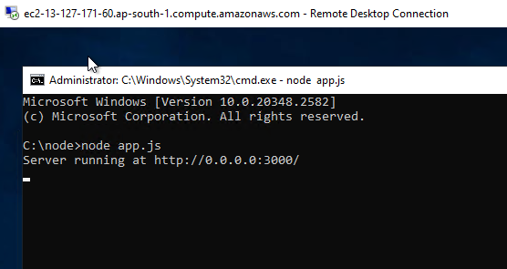
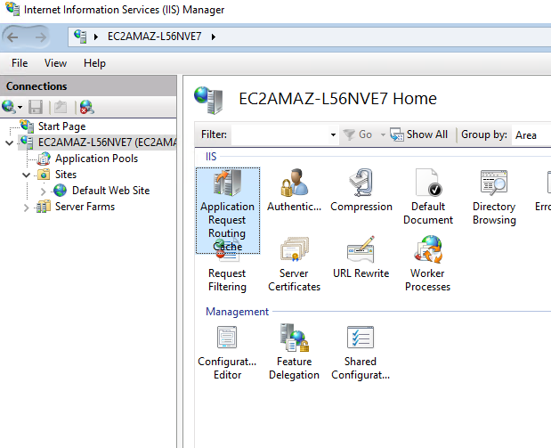
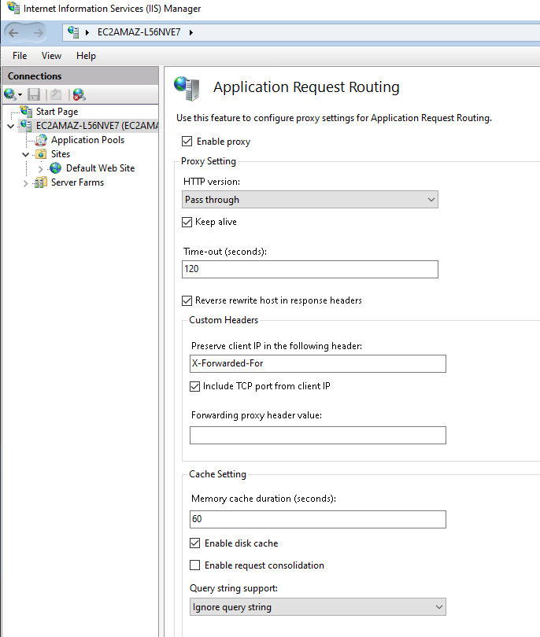
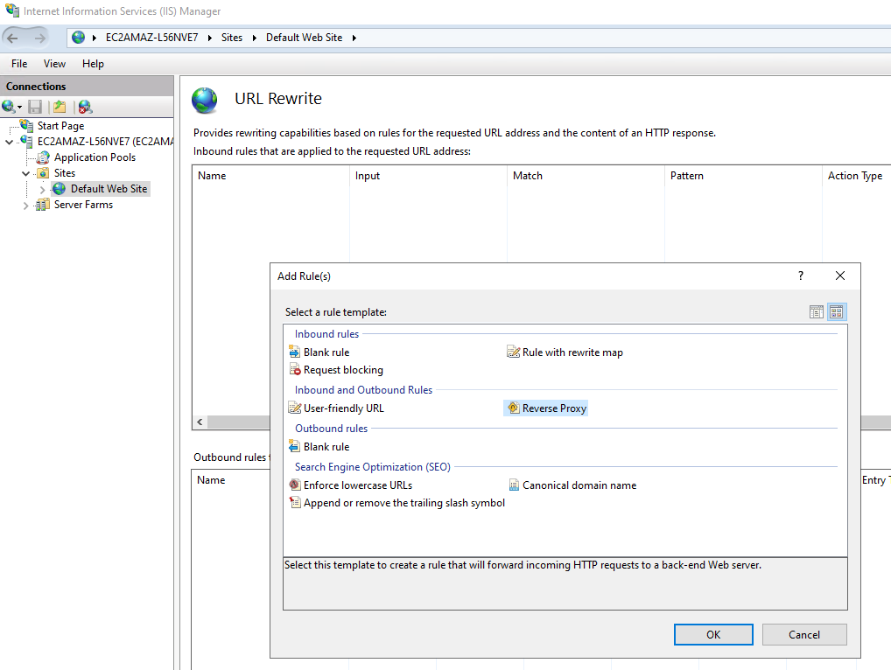
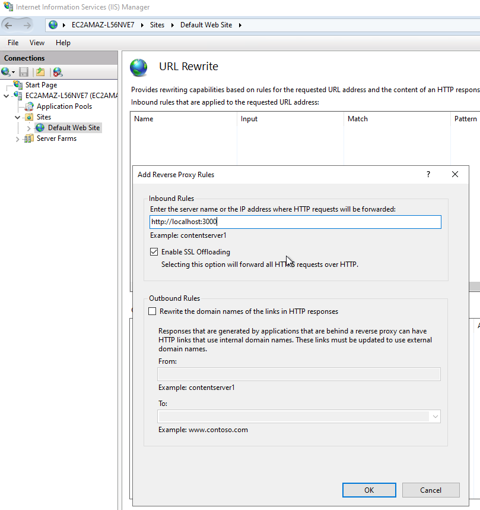
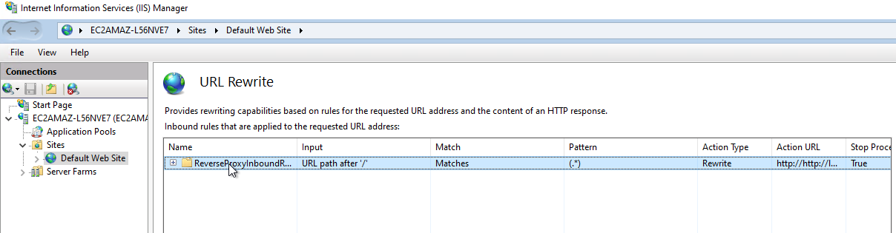
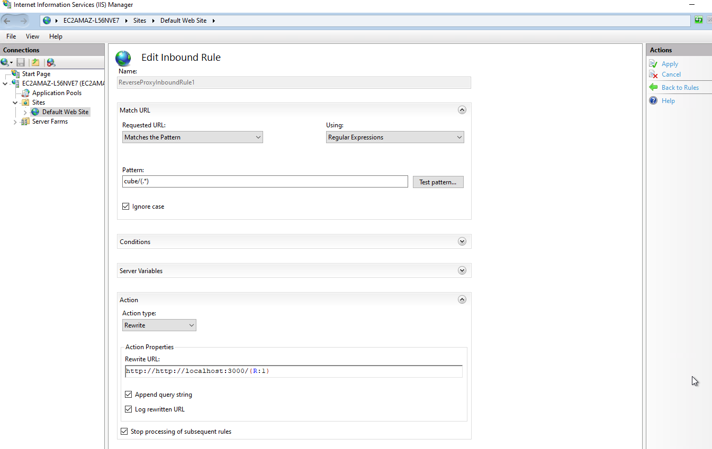
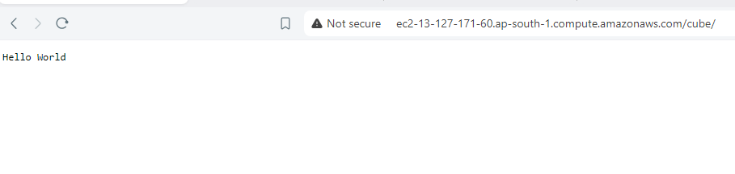

# IIS-Proxy

#### Prerequisites:
- IIS must be installed and service must be active.
- Service must be running where you want to publish, in my case I am using [node project](https://github.com/meibraransari/node-hello-world) and its running on port 4000

#### Setup Addons
To setup IIS Reverse proxy you must install the below addons first. 
- [URL Rewrite](https://www.iis.net/downloads/microsoft/url-rewrite) 
- [Application Request Routing](https://www.iis.net/downloads/microsoft/application-request-routing) 
### Enable Application request routing

### Setup reverse Proxy

### Test reverse Proxy

---

### 💼 Connect with me 👇👇 😊

- 🔥 [**Youtube**](https://www.youtube.com/@DevOpsinAction?sub_confirmation=1)
- ✍ [**Blog**](https://ibraransari.blogspot.com/)
- 💼 [**LinkedIn**](https://www.linkedin.com/in/ansariibrar/)
- 👨‍💻 [**Github**](https://github.com/meibraransari?tab=repositories)
- 💬 [**Telegram**](https://t.me/DevOpsinActionTelegram)
- 🐳 [**Docker**](https://hub.docker.com/u/ibraransaridocker)
